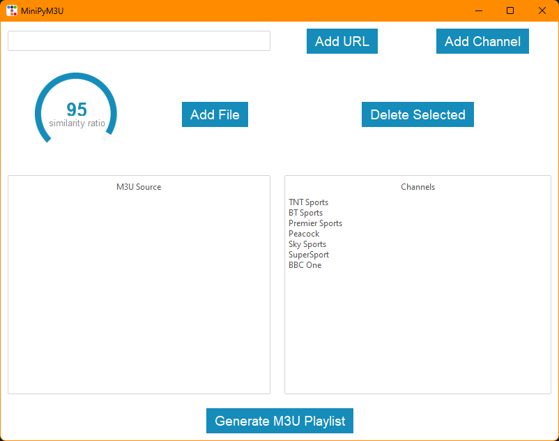

# MiniPyM3U



This project is a simple Python application that checks the channels in an M3U file against a list of channel names based on the similarity ratio using Levenshtein distance algorithm.

## Installation

To install the required dependencies, run the following command:

```sh
pip install -r requirements.txt
```

## Usage

You can either run the GUI application or the script via the terminal.

### GUI

To run the GUI, use the following command:

```sh
python app.py
```

### Script

To run the script, use the following command:

```sh
python m3u.py -f file1.m3u file2.m3u -c channel1 channel2 -o output.m3u
```

#### Arguments

```
-f, --files: The M3U file to check
-u, --urls: The URL of the M3U file to check
-c, --channel-names: The channel name to compare
-r, --similarity-ratio: The similarity ratio (default is 95)
-o, --output-file: The output M3U file
-d, --debug: Enable debug info
```


## Testing

To run the tests, use the following command:

```sh
python -m unittest discover
```

## Contributing

Contributions are welcome. Please open an issue to discuss your idea before making a pull request.

## License

This project is licensed under the terms of the MIT license.